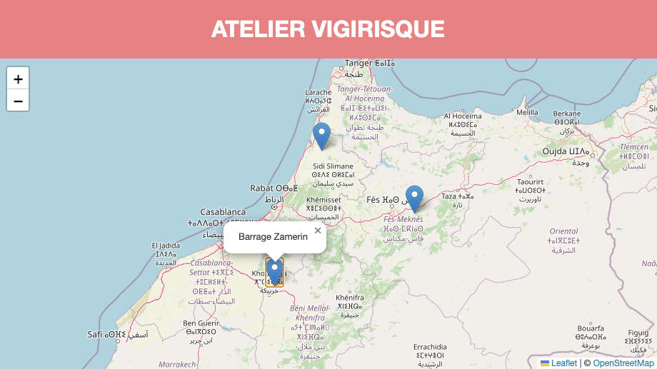

# Atelier Vigirisque / Interface Client

Front-end Angular de l'applicatif Atelier vigirisque.

Affiche les stations provenant de l'API sur une carte.



## Installation

Pré requis
- Node.JS / NPM LTS
- Angular CLI

Installer Angular CLI :
```
npm install -g @angular/cli
```

Dupliquer le fichier de configuration exemple :
```
cp src/assets/environments/environment.example.json src/assets/environments/environment.json
```

Modifier le fichier `environment.json` pour y indiquer l'URL de [l'API](https://github.com/atelier-vigirisque/backend).

Installer les dépendances :
```
npm install
```

### Développement

Lancer la compilation et le serveur HTTP local :
```
npm run start
```


## Installation en production

[Documentation Debian 11](_documentation/installation_debian11.md)
